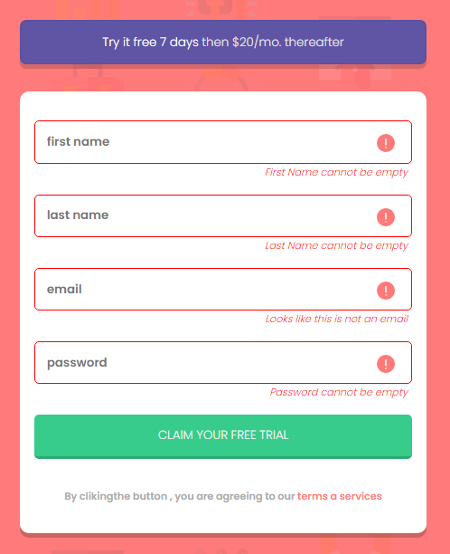

# Frontend Mentor - Intro component with sign up form solution

This is a solution to the [Intro component with sign up form challenge on Frontend Mentor](https://www.frontendmentor.io/solutions/css-grid-layout-flexbox-hkgHGKhNd). 

### Screenshot desktop version

#

### Screenshot mobile version

### Links

- Solution URL: [https://www.frontendmentor.io/solutions/css-grid-layout-flexbox-hkgHGKhNd])

## My process

### Built with

- Semantic HTML5 markup
- CSS custom properties
- Flexbox
- CSS Grid

## Author

- Frontend Mentor - [@marcosDmc](https://www.frontendmentor.io/profile/marcosDmc)
- Twitter - [@_m_code_](https://www.twitter.com/_m_code_)

